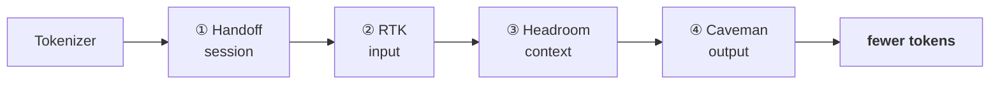

# dsh-token-skills

**Cut token cost in 4 layers — without cutting model intelligence.**

A DeepSeek Harness preset of four complementary token-saving skills. Each one attacks a different stage of the token pipeline, so they *stack*:

> **handoff** the context *→ prune* the input *→ compact* the context *→ terse* the output

Stop paying twice for tokens you already have.



> **Why: every token is money.** A long agent session re-sends context it already paid for — past transcripts, padded logs, verbose replies. These four skills stop that leak at each stage.

---

## The four layers

| # | Skill | Layer | What it saves | Backs off to |
|---|-------|-------|---------------|--------------|
| ① | `handoff` | **Session** | stop re-reading/rebuilding context between sessions | [context-auto-handoff](https://www.npmjs.com/package/context-auto-handoff) |
| ② | `rtk` | **Input** | drop redundant/repeated tokens before they enter the model | [RTK (Rust Token Killer)](https://mintlify.wiki/rtk-ai/rtk/faq) |
| ③ | `headroom` | **Context** | compress the live context so the prompt stays small | [WanYanTianDe/dsh-headroom](https://github.com/WanYanTianDe/dsh-headroom) |
| ④ | `caveman` | **Output** | terse prose — fewer tokens on the way out | [skill-caveman](https://www.npmjs.com/package/skill-caveman) |

Each layer is a thin dsh skill (`skills/<layer>/SKILL.md`). Where a real engine already exists, the skill wires to it instead of re-implementing compression — you get the strategy *and* the engine, for free.

---

## When to use which

- **Handoff** — the highest-leverage, cheapest habit: write a `HANDOFF.md` note at session end so the next one starts warm. Use it on every multi-session project.
- **RTK** — per request, before you paste a big file/log/repo listing that's mostly noise.
- **Headroom** — continuous, for long-lived agents: compact before the window fills, not at the cliff edge.
- **Caveman** — every reply: it costs nothing and compounds. It changes *style*, never *substance*.

They stack to a single habit, not a heavy setup:

```text
before: [past session verbatim] + [entire repo dump] + [fat context] + [verbose response]
after:  HANDOFF note      → pruned diff      → compacted headroom  → terse reply
```

---

## Install

```sh
dsh plugin --profile web add dsh-token-skills
```

Or clone it and drop the skills into `~/.dsh/skills/`:

```sh
git clone https://github.com/WODE25500/dsh-token-skills
```

Each skill is also invocable directly — `handoff`, `rtk`, `headroom`, `caveman`.

---

## Validation

```sh
npm test   # runs scripts/check-skills.mjs — asserts every bundled skill's frontmatter
```

---

## License

MIT
