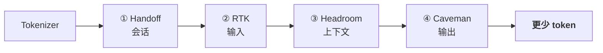

# dsh-token-skills

**四层省 Token,不牺牲模型智能。**

一个 DeepSeek Harness 预设,内含四个互补的省 Token skill。每一层专治 token 管道的不同阶段,因此**可以叠加**:

> **交接**上下文 → **剪**输入 → **压**上下文 → **砍**输出

别为已经拥有的 token 再付一次钱。



> **为什么:每个 token 都是钱。** 一个长会话会把已经付过钱的上下文再发一遍——旧对话、padding 满屏的日志、啰嗦的回复。这四个 skill 在每一层堵住这个泄漏。

---

## 四层

| # | Skill | 层 | 省什么 | 依赖引擎 |
|---|-------|-------|--------|------|
| ① | `handoff` | **会话** | 免去跨会话重读/重建上下文 | [context-auto-handoff](https://www.npmjs.com/package/context-auto-handoff) |
| ② | `rtk` | **输入** | 进模型前剪掉重复/冗余 token | [RTK (Rust Token Killer)](https://mintlify.wiki/rtk-ai/rtk/faq) |
| ③ | `headroom` | **上下文** | 压缩在线上下文,让 prompt 保持小 | [WanYanTianDe/dsh-headroom](https://github.com/WanYanTianDe/dsh-headroom) |
| ④ | `caveman` | **输出** | 极简原话,出口更少 token | [skill-caveman](https://www.npmjs.com/package/skill-caveman) |

每层是一个轻量 dsh skill(`skills/<layer>/SKILL.md`)。已有真实引擎的地方,skill 直接引用,不重造压缩——**策略和引擎都给你,白赚。**

---

## 何时用哪层

- **Handoff** —— 杠杆最高、最便宜:会话结束时写 `HANDOFF.md`,下一会话暖启动。每个多会话项目都该用。
- **RTK** —— 单次请求:准备贴大文件/日志/仓库列表前先剪。
- **Headroom** —— 持续:长命 agent,趁窗口还没满就压,别等到悬崖边。
- **Caveman** —— 每次回复:零成本、复利;只改*措辞*,从不丢*内容*。

四层叠成一个习惯,不是重配置:

```text
before: [上会话原文] + [整仓库 dump] + [肥大上下文] + [啰嗦回复]
after:  HANDOFF 笔记   → 剪过的 diff   → headroom 压缩  → 极简回复
```

---

## 安装

```sh
dsh plugin --profile web add dsh-token-skills
```

或 clone 后把四个 skill 目录放进 `~/.dsh/skills/`:

```sh
git clone https://github.com/WODE25500/dsh-token-skills
```

每个 skill 也可单独调用:`handoff`、`rtk`、`headroom`、`caveman`。

---

## 校验

```sh
npm test   # 运行 scripts/check-skills.mjs,断言每个 bundle skill 的 frontmatter
```

---

## 许可

MIT
